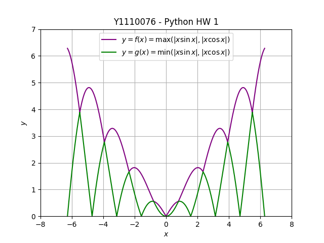
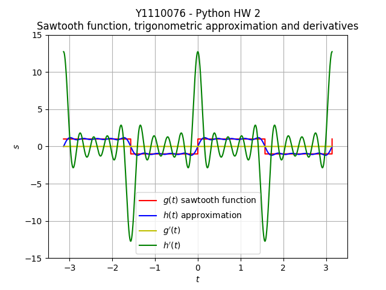
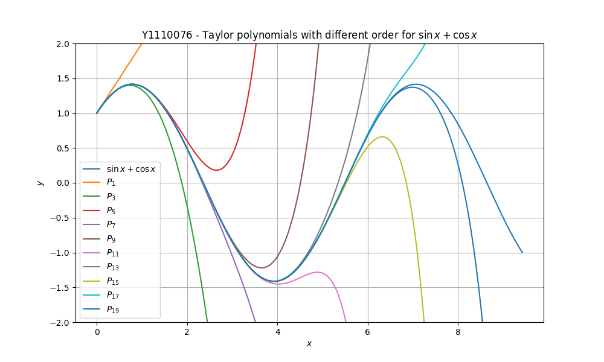

# NCU Calculus Python Homework (111)

This repository holds the code for Python homework of the NCU calculus course
in year 111.

## First semester

| Homework         | Code                                 | Output                      | Link                          |
|------------------|--------------------------------------|-----------------------------|-------------------------------|
| HW1(09/26~10/11) | [HW1.py](1111/HW1/HW1.py)            |        | [Exercise 1-1][1111-HW1-link] |
| HW2(10/24~11/15) | [HW2.py](1111/HW2/HW2_submission.py) |        | [Exercise 2-3][1111-HW2-link] |
| HW3(11/28~12/20) | [HW3.py](1111/HW3/HW3.py)            | [HW3.txt](1111/HW3/HW3.txt) | [Exercise 6-3][1111-HW3-link] |

[1111-HW1-link]: http://python.math.ncu.edu.tw/exercise/python/1-1
[1111-HW2-link]: http://python.math.ncu.edu.tw/exercise/python/2-3
[1111-HW3-link]: http://python.math.ncu.edu.tw/exercise/python/6-3

## Second Semester

| Homework         | Code                      | Output                | Link                          |
|------------------|---------------------------|-----------------------|-------------------------------|
| HW1(03/01~03/16) | [HW1.py](1112/HW1/HW1.py) |  | [Exercise 7-2][1112-HW1-link] |

[1112-HW1-link]: http://python.math.ncu.edu.tw/exercise/python/7-2
